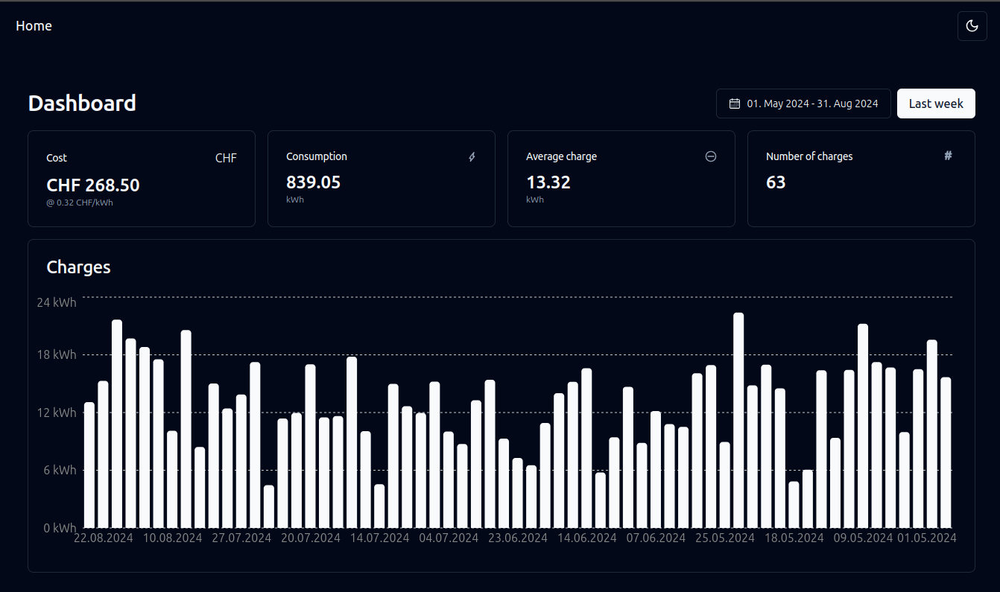

# EV Charging Dashboard

A small Next.js dashboard that visualizes charging history data from an eCarUp-compatible API and calculates costs.

**What this dashboard provides**

- **Charge history visualization:** interactive bar chart of charging sessions.
- **Consumption summaries:** total kWh, average charge, number of charges.
- **Cost calculation:** calculates CHF cost using a configurable kWh price.

## Screenshots

Dark and bright theme for both mobile and desktop view are available <br />


## How to use

1. Install dependencies:

```bash
npm install
```

2. Provide environment variables (locally create a `.env` or `.env.local`):

```env
DATA_URL=https://www.ecarup.com
ECARUP_USERNAME=you@example.com
ECARUP_PASSWORD=yourpassword

# Optional: expose the kWh price to the client (used for cost calculation)
NEXT_PUBLIC_KWH_PRICE=0.32
```

3. Start the development server:

```bash
npm run dev
```

4. Open the app at http://localhost:3000

## Environment variables (summary)

- `DATA_URL` (required): base URL for the eCarUp API (used by server-side fetches).
- `ECARUP_AUTH` (optional): full `Basic <base64>` authorization header. If not provided, `ECARUP_USERNAME` and `ECARUP_PASSWORD` will be combined.
- `ECARUP_USERNAME` and `ECARUP_PASSWORD` (optional): used to build Basic auth when `ECARUP_AUTH` is not set.
- `NEXT_PUBLIC_KWH_PRICE` (optional/emitted to client): price used in the UI to compute CHF cost.

If required server vars are missing, the API route will return a 500 error explaining which variables are missing.
